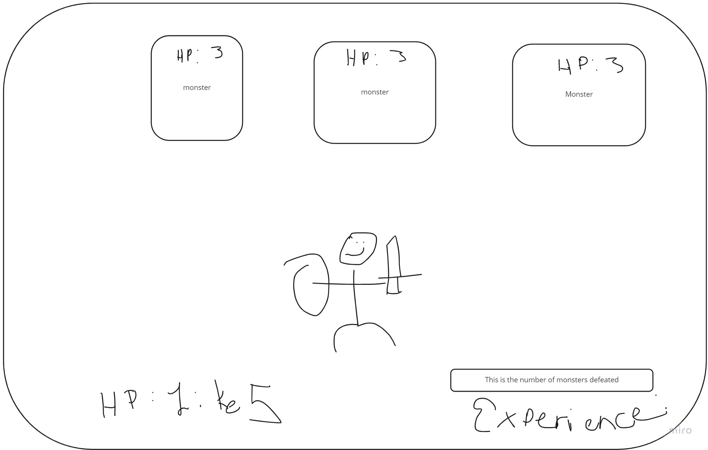

## The Golden Rule: 

🦸 🦸‍♂️ `Stop starting and start finishing.` 🏁

If you work on more than one feature at a time, you are guaranteed to multiply your bugs and your anxiety.

## Making a plan

<!-- 1) **Make a drawing of your app. Simple "wireframes"**  -->
1) **Look at the drawing and name the HTML elements you'll need to realize your vision**
multiple sections for storing each thing. i've found it easier to organize this way.
A form for gathering data.
Divs to hold each thing

1) **Look at the drawing and imagine using the app. What _state_ do you need to track?** 
Your HP, 
Goblins Defeated,
Goblin HP.
1) **For each HTML element ask: Why do I need this? (i.e., "we need div to display the results in")** 
sections for the the goblins to live, the player to live, and the state we are tracking to live.

1) **Once we know _why_ we need each element, think about how to implement the "Why" as a "How" (i.e., `resultsEl.textContent = newResults`)**
form.addeventListener('submit' (e) => {}
  gathers goblin name info
  starts generation of goblin process
  const data = newFormData(formEl)
  data.get('goblin') <--- could be wrong on this. I am only assuming
  for( let goblin of goblins ) loop to set up clickables
  
) 

don't forget to have the math.random to see if you hit or if its you with if else statesments ++ or -- your/goblins health.
goblins.

1) **Find all the 'events' (user clicks, form submit, on load etc) in your app. Ask one by one, "What happens when" for each of these events. Does any state change? Does any DOM update?**
form.addeventListener
displayGoblins function
render Goblins function
Maybe make an array file???

Would be cool also if the goblin dies to change to source to dead goblin.

1) **Think about how to validate each of your features according to a Definition of Done. (Hint: console.log usually helps here.)**
1) **Consider what features _depend_ on what other features. Use this dependency logic to figure out what order to complete tasks.**

Additional considerations:
- Ask: which of your HTML elements need to be hard coded, and which need to be dynamically generated?
- Consider your data model. 
  - What kinds of objects (i.e., Dogs, Friends, Todos, etc) will you need? 
  - What are the key/value pairs? 
  - What arrays might you need? 
  - What needs to live in a persistence layer?
- Is there some state we need to initialize?
- Ask: should any of this work be abstracted into functions? (i.e., is the work complicated? can it be resused?)

